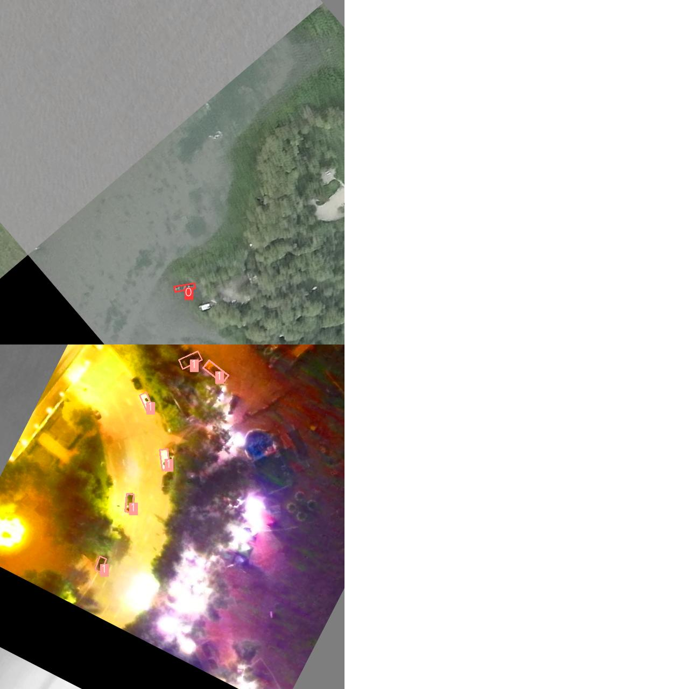
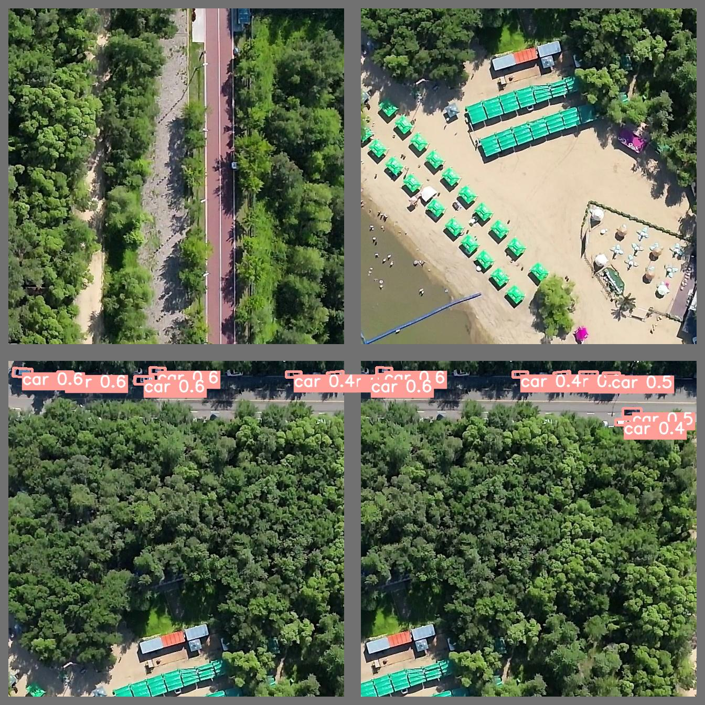

# Datasets Description
**ori_images**: VI(1920\*1200), IR(640\*512)

**splited_images**: 640\*640

**labels**: 1 for car, 0 for ship

# Workflow
ori_images -> splited_images -> model -> splited_labels -> merged_labels -> nms -> final_labels

# Utils
1. visualization.py: display test_results.
2. gflop_cal.py: calculate model flops.
3. DOTA_devkit/ImgSplit_multi_process.py: split images.
4. DOTA_devkit/ResultMerge_multi_process.py: merge results.

# Strategy
1. We adopt yolov5m.pt as backbone for the limited usage 30GFLOPs.
2. CSL split angles into 180 classes.

# Run
**train**: `bash train_split.sh`

**test**: `python detect.py`

# Drawbacks
1. IR images perform bad both in train and test stages.

# Future work
1. RFLA: use gaussian representation instead of bbox_iou for better matching.

(revised 08/17)

# Yolov5 for Oriented Object Detection Competition
The code for the implementation of “[Yolov5](https://github.com/ultralytics/yolov5) + [Circular Smooth Label](https://arxiv.org/abs/2003.05597v2)”. 

# Installation
Please refer to [install.md](./docs/install.md) for installation and dataset preparation.

# Getting Started 
This repo is based on [yolov5](https://github.com/ultralytics/yolov5) and [yolov5_obb](https://github.com/hukaixuan19970627/yolov5_obb). 

And this repo has been rebuilt, Please see [GetStart.md](./docs/GetStart.md) for the Oriented Detection latest basic usage.

#  Acknowledgements
I have used utility functions from other wonderful open-source projects. Espeicially thank the authors of:

* [ultralytics/yolov5](https://github.com/ultralytics/yolov5).
* [hukaixuan19970627/yolov5_obb](https://github.com/hukaixuan19970627/yolov5_obb)
* [自己改建YOLOv5旋转目标的踩坑记录](https://www.zhihu.com/column/c_1358464959123390464).
* [配置torch1.13环境下nms](https://blog.csdn.net/code_zhao/article/details/129172817）

## 
在使用中有任何问题，建议先按照[install.md](./docs/install.md)检查环境依赖项，再按照[GetStart.md](./docs/GetStart.md)检查使用流程是否正确.

